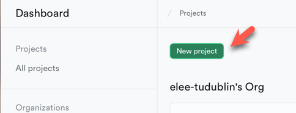
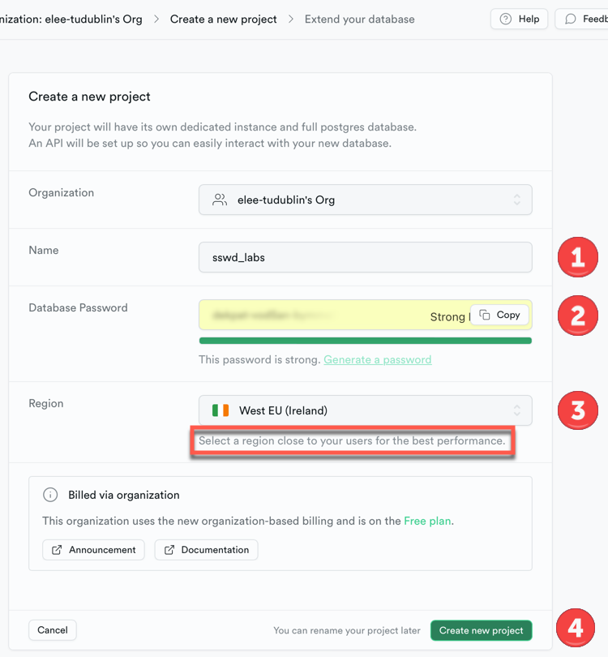
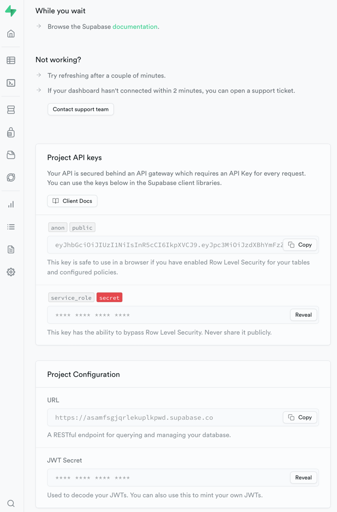
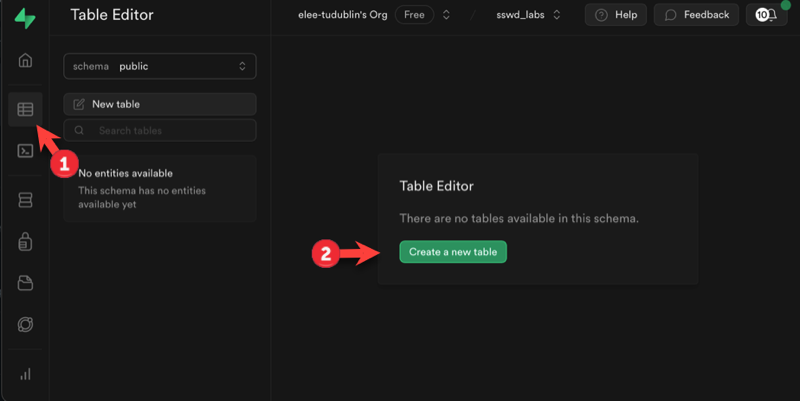
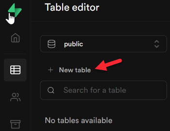
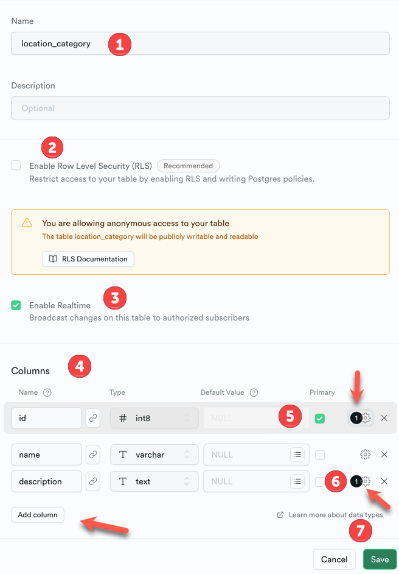
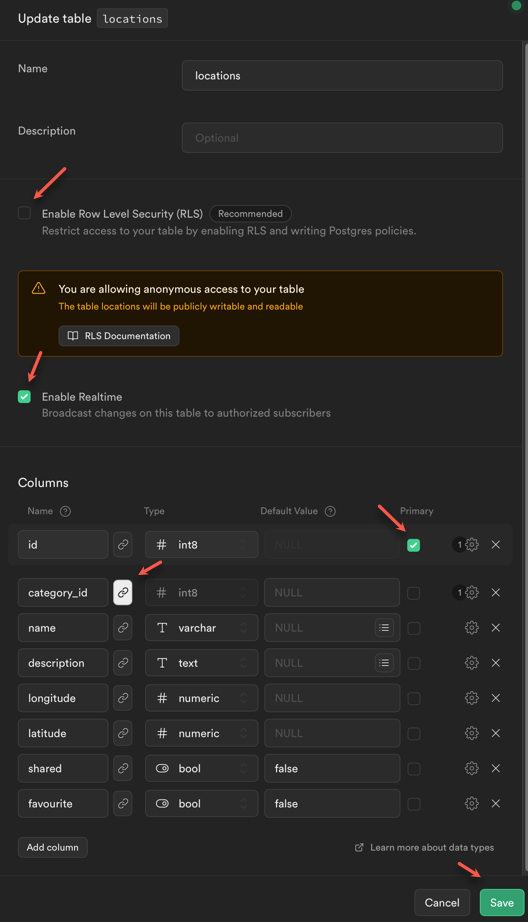
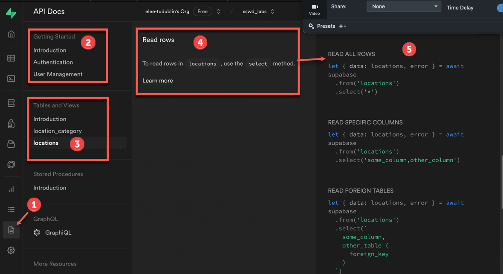

# Setting up a database using Supabase


## Introduction

We will be using a Relational SQL database provided by http://supabase.com. This is a cloud-based service which provides a free database with a built in web and JavaScript API for accessing the database via HTTP. This has the advantage of not requiring a separate API layer to access data. 

## Setting up a Supabase account

Supabase is free to use for small projects and It is also very well documented.

To set up your account, visit <https://supabase.com/> and sign in using your GitHub account. If you don’t have one, set up a GitHub account using your student email account.


## The database ERD

We will be developing an application to keep track of **locations** or **Points of Interest**. This lab will focus on the database setup and creation of the first two tables


There is a `one to many` relationship between the tables so that one `location_category` may contain many `locations`.

## 1. Create a new database

### 1.1. A new Supabase Project for the database

After logging in choose **New Project** from the dashboard.



### 1.2. Add the new project to your ‘organisation’

##### Complete the form to create a new project

1. name the project **`sswd_labs`**
2. Set a secure password - **you will need this later so do not forget!**
3. Supabase is hosted on AWS, choose **`West EU (Ireland)`** as this is the closest data centre.
4. Don't forget to **Create new project**.




### 1.3. Wait for setup to complete

It may take a few minutes for the database setup to complete. While waiting, review the database information about API keys, etc.





## 2. Add tables to the database

Once setup has completed, the project welcome page will display and you can start adding tables to the database. You will be adding two tables, based on the ERD, starting with **`location_category`**. Postgres works better with lowercase names so follow this example when setting up your tables.


### 2.1. Choose the ‘table editor’

Tthe **table editor** button in the left menu will list existing tables and also show the **Create new table** button. Press that to start.



### 2.2. Add the `location_category` table




#### 1. Add the columns and set the data types as shown below. Set the id column as Primary Key

Use the form to specify the table attributes and columns

1. Name the table

2. For now **untick** the option for **Enable Row Level Security (RLS)**. This will be used in the next lab but this week's example will not work if it is enabled.

3. Enable Realtime - for use in a future lab.

4. Add the Columns. Note the `Add column` and `X` buttons for each column.

   * id is the **`primary key`**. Click the cog icon and set the option for **`is identity`**. This will automatically generate the `id` on `INSERT`.
   * Click the cog icon for the `description` column and set the option to allow `NULL` values.

5. When complete press the **`save`** button.

 


### 2.3.  The `locations` table

This table will be used to store map co-ordinates as 


### 2.4 Create the  `locations` table

Using the **SQL Editor** (from the left menu options), enter the following **`SQL`** and **`Run`** to add the `locations` :

```sql
-- The locations table
create table if not exists
  public.locations (
    id bigint generated by default as identity,
    category_id bigint,
    name varchar not null,
    description text not null,
    longitude numeric not null,
    latitude numeric not null,
    shared BOOLEAN not null default false,
    favourite BOOLEAN not null default false,
    
    -- Primary and Foreign key constraints
    CONSTRAINT locations_pkey PRIMARY KEY (id),
    CONSTRAINT locations_category_id_fkey FOREIGN KEY (category_id) REFERENCES location_category (id)
  );

```

### 2.5 Verify that `locations` was added

Open the new `locations` table in the editor and verify that it is correct. 

* Verify the `Foreign Key` relation is set up.

* Ensure that `Row Level Security` is **NOT ENABLED**.

* Select the **`Enable Realtime`** option.

  




## 3. Adding sample data

Next you will add some sample data.

### 3.1.  Adding `location_category` data

Open the **`SQL Editor`** and run the following **`SQL`**.

```sql
INSERT INTO public.location_category(id, name, description) VALUES
(1, 'Restaurant', 'Places to eat');
INSERT INTO public.location_category(id, name, description) VALUES
(2, 'EV Fast Chargers', 'Places to charge quickly');
INSERT INTO public.location_category(id, name, description) VALUES
(3, 'Scenic', 'Places with nice views');
INSERT INTO public.location_category(id, name, description) VALUES
(4, 'Shopping', 'Places to shop');
INSERT INTO public.location_category(id, name, description) VALUES
(5, 'Hospitals', NULL);
INSERT INTO public.location_category(id, name, description) VALUES
(6, 'Education', NULL);
INSERT INTO public.location_category(id, name, description) VALUES
(7, 'Parks', NULL);
INSERT INTO public.location_category(id, name, description) VALUES
(8, 'Other', '');
```

If you try to run this more than one, expect to see **duplicate key value** errors.


**Exercise:**

1. Add some more location categories. Try the SQL Editor and the **Insert** option in the **Table Editor**.

2. Use the SQL Editor to run

   ```sql
   select * from location_category
   ```

   What was the result?


### 3.2. Adding `locations` data

To add a location, you will need to obtain its geo location as `(Longitude, Latitude)`. These can be obtained from [OpenStreetMap](https://www.openstreetmap.org/search?query=tu%20Dublin%20tallaght#map=17/53.29109/-6.36345) or  [Google Maps](https://www.google.ie/maps/@53.290976,-6.3658086,17.06z?entry=ttu) (right-click a location) but **note that these co-ordinates are in (Latitude, Longitude) format**.

See https://supabase.com/docs/guides/database/extensions/postgis?language=sql

This is an example **`INSERT`** query. Run it to add this location to your database. Note the **`st_point(LONG, LAT)`** `posstGIS` function is used to encode the  for the location.

```sql
INSERT INTO public.locations(category_id, name, description, longitude, latitude, shared, favourite) VALUES
(7, 'TU Dublin Tallaght Campus', 'Old Blessington Road, Tallaght, Dublin 24, Ireland', -6.36352, 53.29109, true, true);
```

**Exercise:** Add some more locations based on this example and **location categories**


## 4. The Supabase API

Use the Supabase API to retrieve data from the database and insert new data. Click on the API section in the dashboard to view the settings and documentation. We will be using **client key** and **`SUPABASE_URL`** in the next lab to connect to the API and get data.

The dashboard also includes documentation and JavaScript code examples showing how to access data and other features. For now, get familiar with the content of this section as we will be refering to it a lot!



------

**Enda Lee 2023**
