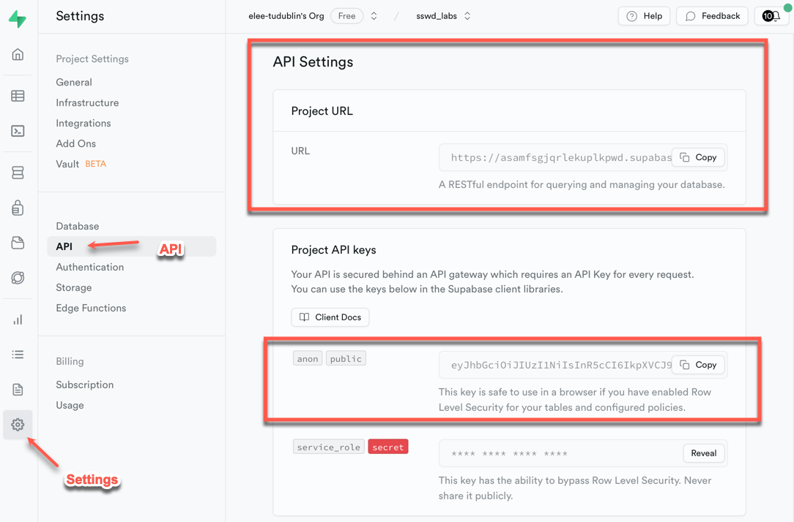
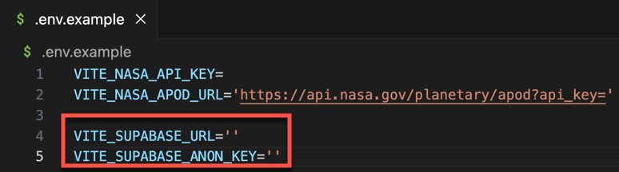
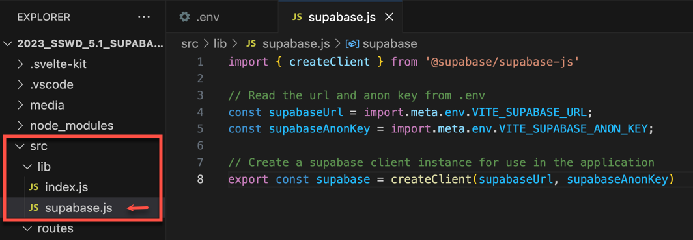
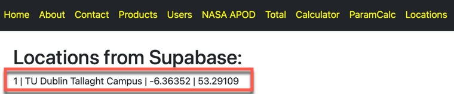
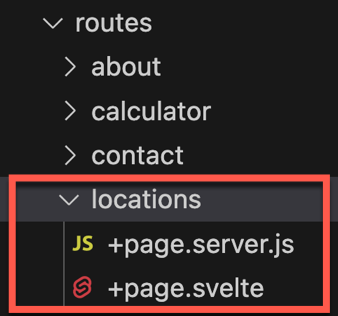
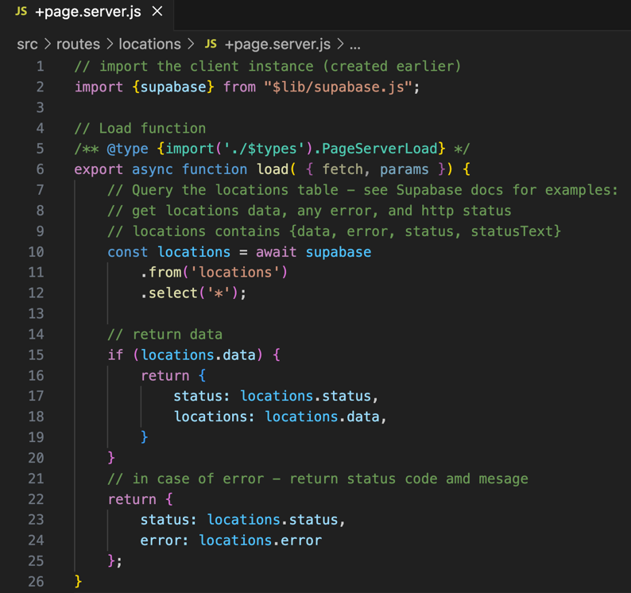
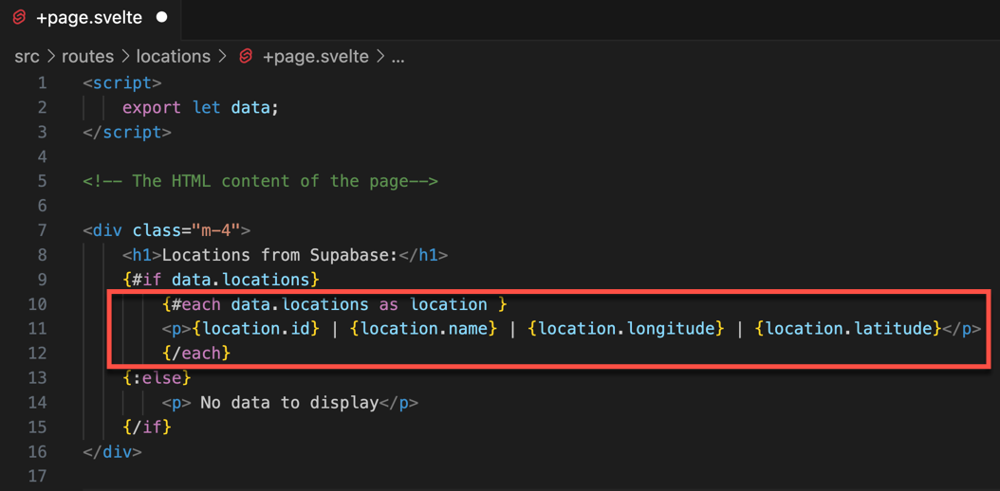
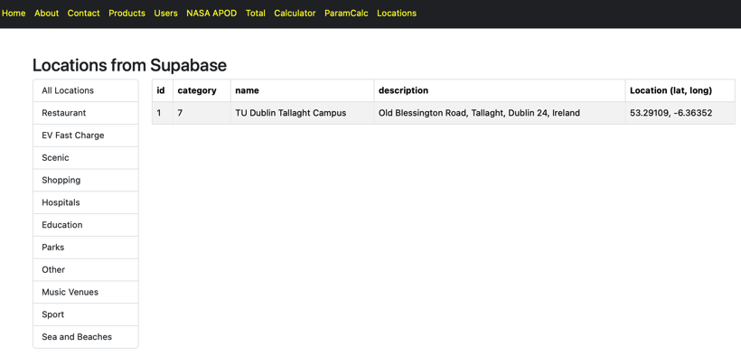

#  Part 2 - Connect to to the Supabase API, get data, and display

Enda Lee 2023

### Quick Start

1. Download the start site from this repository.
2. Open in VS Code.
3. In a terminal run `npm install`.
4. Start the application using `npm run dev`.

This repository includes solution to the previous lab exercises. You will need to add `.env` and set your API keys etc.

## Introduction

This tutorial will use **SvelteKit** to create a client website which will connectto Supabase, get some data, and display it.

This continues from [part1_supabase.md](part1_supabase.md) .


## 1. Pre-requisites

The client functionality is dependent on the Supabase DB from [part1_supabase.md](part1_supabase.md). Make sure your DB is setup before continuing.


## 2. Install dependencies

Supabase provides a JavaScript library to its features, including querying the database. Install this library using npm:

```bash
npm install @supabase/supabase-js
```


## 3. Setup the connection

The next step is to configure the web application so that it can access Supabase. The required settings can be found in the dashboard. 

1. You will need the  `Project URL` and the **`anon public`** API key. **Do Not use the Secret Key!**




2. **These values should be stored in the `.env` file, using the following variables: **



**Note: you will find `.env.example` in the lab repo, this can be used as a template for your `.env`**


3. **Create an instance of the Supabase client**

   Add `supabase.js` to the `lib` folder. You will find this in the `src` folder. This script uses `createClient` from the Supabase library to open a connection to the database URL using the anon API Key.  




## 4. Get data from Supabase and display in a page

This is similiar to the previous example for products and users but this time you will use your own database.

The result should look similiar to this screenshot (depending on how many locations in your database):




1. Add a route and files for `/locations`. We sill be using server side rendering in this example.

   


2. Connect to Supabase and get the location data, in `+page.server.js` The query starts at `Line 9` - this is equivelent to `select * from locations`, See the API documentation in your database for more example of how to query data.

   ```javascript
     const locations = await supabase
           .from('locations')
           .select('*');
   ```

   

   

3. Display the data in `+page.svelte`

   This is similiar to previous examples. The `{#each}{/each}` block iterates through and displays `data.locations`.

   The `{#if}{/if}` block is used to check that the page data contains locations before the loop. 

   

   

## 5. Exercise

Display location categories and locations on the page - based on the products and users examples. Something like this:




------

Enda Lee 2023